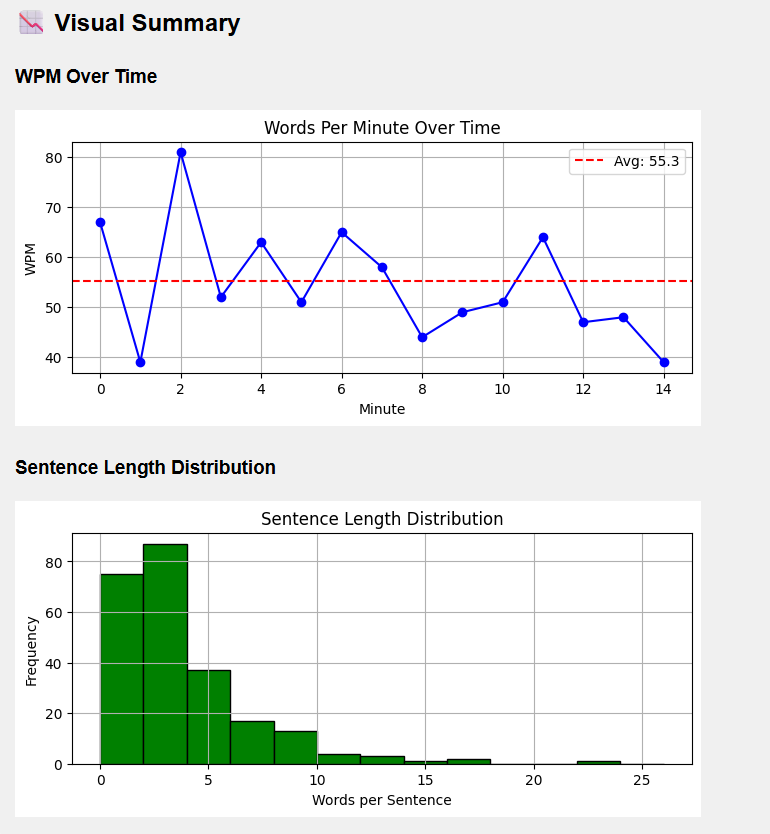

# speech-fluency-coach

## プロジェクト概要

本プロジェクトは、英語スピーキング力の向上を目的とした自己記録・分析ツールです。録音された英語音声（5〜15分程度）を文字起こしし、話者の発話傾向や課題を定量的に可視化することで、継続的な改善と学習モチベーションの維持を支援します。

---

## 実装機能

### 1. 発話速度の計測（Words per Minute）

- 音声全体に対する平均発話速度（WPM）を算出
- 1分ごとのWPMを時系列で出力（折れ線グラフ付き）
- 音声全体に対する平均発話速度（WPM）を算出
- 1分ごとのWPMを時系列で出力（折れ線グラフ付き）

### 2. 文の長さの統計分析

- 1文あたりの単語数の平均・中央値・最大・最小を算出
- 文の区切りは Whisper のセグメント単位で処理
- 文長のヒストグラムを生成
- 1文あたりの単語数の平均・中央値・最大・最小を算出
- 文の区切りは Whisper のセグメント単位で処理
- 文長のヒストグラムを生成

### 3. 言い淀みの検出と指標化

- 以下の言い淀み表現の出現頻度をカウント：
  - 繰り返し（例：I... I don't know）
  - フィラー（例：uh, um, like, well, okay）
- 全体の単語数に対する出現割合（%）を算出

### 4. HTMLレポートの自動生成（analyzer.py）

- セグメントを1分ごとに色分けして表示
- 各分のWPMと平均文長を表示
- 統計サマリー（WPM、文長、言い淀み）をHTMLに出力
- WPMの推移グラフと文長ヒストグラムを埋め込み

### 5. AI分析用プロンプト生成（Markdown）

- Whisperのセグメントを番号付きでMarkdownに整形
- 厳密な評価基準に基づくプロンプトを自動生成
- AIに対して：
  - 文法的に正確で自然な文のみ ✅ と判定
  - 不自然な文は ❌ として修正文＋理由を提示
  - 元文は繰り返さず、セグメント番号で参照
  - OKな文は番号のみを1行で出力（例：[001], [002], [003]）
- 以下の言い淀み表現の出現頻度をカウント：
  - 繰り返し（例：I... I don't know）
  - フィラー（例：uh, um, like, well, okay）
- 全体の単語数に対する出現割合（%）を算出

### 4. HTMLレポートの自動生成（analyzer.py）

- セグメントを1分ごとに色分けして表示
- 各分のWPMと平均文長を表示
- 統計サマリー（WPM、文長、言い淀み）をHTMLに出力
- WPMの推移グラフと文長ヒストグラムを埋め込み

### 5. AI分析用プロンプト生成（prompt.py）

- Whisperのセグメントを番号付きでMarkdownに整形
- 厳密な評価基準に基づくプロンプトを自動生成
- AIに対して：
  - 文法的に正確で自然な文のみ ✅ と判定
  - 不自然な文は ❌ として修正文＋理由を提示
  - 元文は繰り返さず、セグメント番号で参照
  - OKな文は番号のみを1行で出力（例：[001], [002], [003]）

---

## 出力形式

- Markdown（.md）形式：AI分析用プロンプト付きスクリプト
- HTML（.html）形式：統計・グラフ付きレポート
- グラフは base64 でHTMLに埋め込み済み（外部ファイル不要）


例：

```
Average WPM: 55.33
WPM Range: 39.0 - 81.0
Total Sentences: 240
Average Sentence Length: 3.41 words
Median Sentence Length: 2.00 words
Sentence Length Range: 1 - 22 words
Filler Words: 31 (3.79%)
Repetitions: 1 (0.12%)
```
---

## 拡張予定（将来的なアイデア）
- 不自然な表現の自動検出とフィードバック
- スピーキング成長の時系列比較（過去ログとの比較）
- GitHub Actions による自動レポート生成と公開

---

## 環境構築

### Whisper のインストール

```bash
pip install git+https://github.com/openai/whisper.git
```

参考: [Qiita記事](https://qiita.com/taiki_i/items/99cb17049597fdee6ce2)

### FFmpeg のインストール

- バイナリダウンロード: [FFmpeg Builds](https://github.com/BtbN/FFmpeg-Builds/releases)
- 環境変数に以下のパスを追加（例）:

```
C:\Program Files\ffmpeg-master-latest-win64-gpl-shared\bin
```

---

## ファイル構成（例）

```
project/
├── analyzer.py                  # HTMLレポート生成スクリプト
├── generate_prompt.py           # AIプロンプト付きMarkdown生成スクリプト
├── data1_transcription.json     # Whisper出力（文字起こし結果）
├── transcription_report.html    # 分析レポート（自動生成）
├── ai_analysis_input.md         # AI分析用入力ファイル（自動生成）
```

